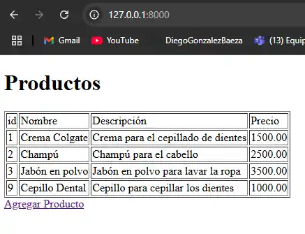

# Evaluacion_M7_S4
Proyecto educativo

CUE: CLAVES PRIMARIAS Y CRUD
DRILLING: LISTADO DE PRODUCTOS
Para resolver este ejercicio, anteriormente debe haber revisado la lectura y los videos del CUE: Claves
Primarias y Crud.
EJERCICIO:
Debes desarrollar el prototipo de una funcionalidad para el sitio de un supermercado. Lo primero será
crear la siguiente vista que lista algunos productos. 

# RESULTADO:

